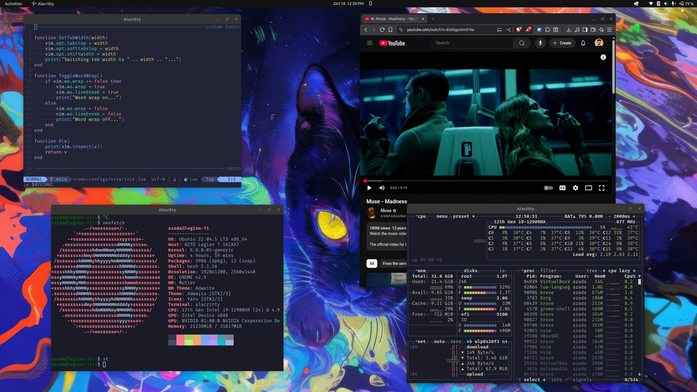
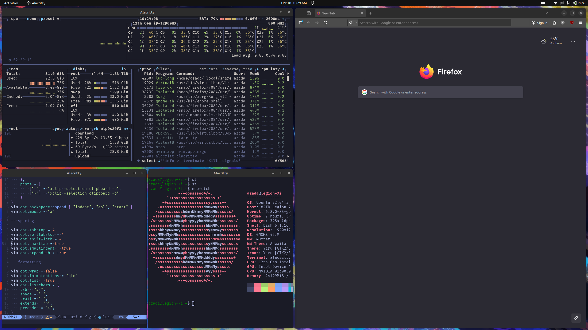
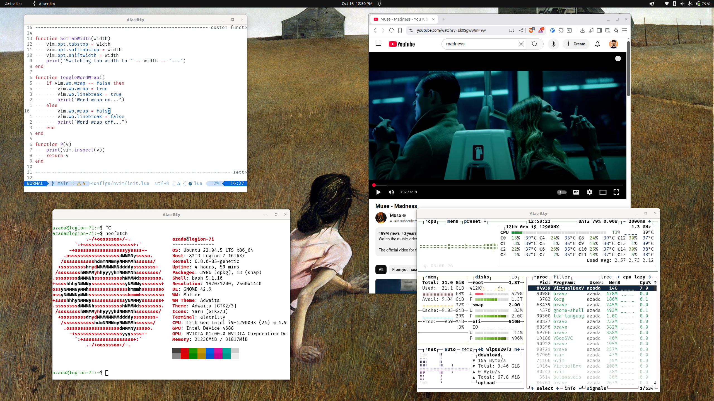

# Configs

A Ubuntu 22.04 config for the best of all worlds:

- Opt-in tiling window management
- Minimal customization headache
- Just works (for AI, Robotics, Web)
- 0 to 100 in 30 minutes
- System wide theme switching

Inspired by [Omarchy](https://omarchy.org/)

## DISCLAIMER

Don't use without checking the configs, there might be some personalization in the scripts that you might not want. I am not responsible for any breakage.

## Software Used

- Ubuntu 22.04 (Gnome)
- Zellij
- Pop Shell
- Neovim
- Alacritty
- Du-Dust
- Ripgrep
- Eza
- Brave
- Btop
- Fira Code Nerd Font

## Usage

1. Clone this repository

2. Read the code

3. Run `./scripts/install-ubuntu-22-desktop.sh`

## TODO

- add zotero plugins
    - better bibtex
    - obsidian note
    - zotmoov
